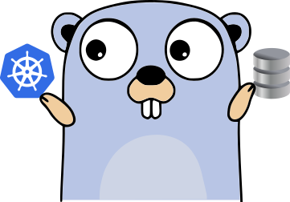

# Kubernetes DBaaS
### *A unique Kubernetes Database-as-a-Service (DBaaS) Operator for declarative, self-service database provisioning in DBMS solutions.*

All documentation can be found on the [Kubernetes DBaaS website](https://bedag.github.io/kubernetes-dbaas).

## Description

The **Kubernetes Database-as-a-Service (DBaaS) Operator** ("the Operator") is a [Kubernetes
Operator](https://kubernetes.io/docs/concepts/extend-kubernetes/operator/) used
to provision database instances in database management systems:

- The Operator can be easily configured and installed in a Kubernetes cluster
  using the provided Helm Chart.
- End-users such as software developers are able to create new database
  instances by writing simple Database custom resources.
- Operations on DBMS are implemented using stored procedures called by the
  Operator whenever necessary, allowing you to define your own custom logic.
- Credentials to access provisioned database instances are saved into Kubernetes
  Secrets.
  
Written using [Go](https://go.dev/) and the [Operator SDK](https://github.com/operator-framework/operator-sdk).
  
## Main features

- Level-based logging
- Event logging, metrics
- Credential rotation
- Helm deployment
- Rate-limited requests
- Modern tech-stack
- Flexible configuration

## Supported DBMS

- SQLServer
- PostgreSQL
- MySQL/MariaDB

## Contributing

There is a comprehensive set of guidelines and helpful documentation.

Please read [How to contribute](https://bedag.github.io/kubernetes-dbaas/docs/contributing/how-to-contribute) to get started.

## Credits

Copyright © 2021 [Cristiano Colangelo](https://github.com/criscola) —
Developed for Bedag Informatik AG.
