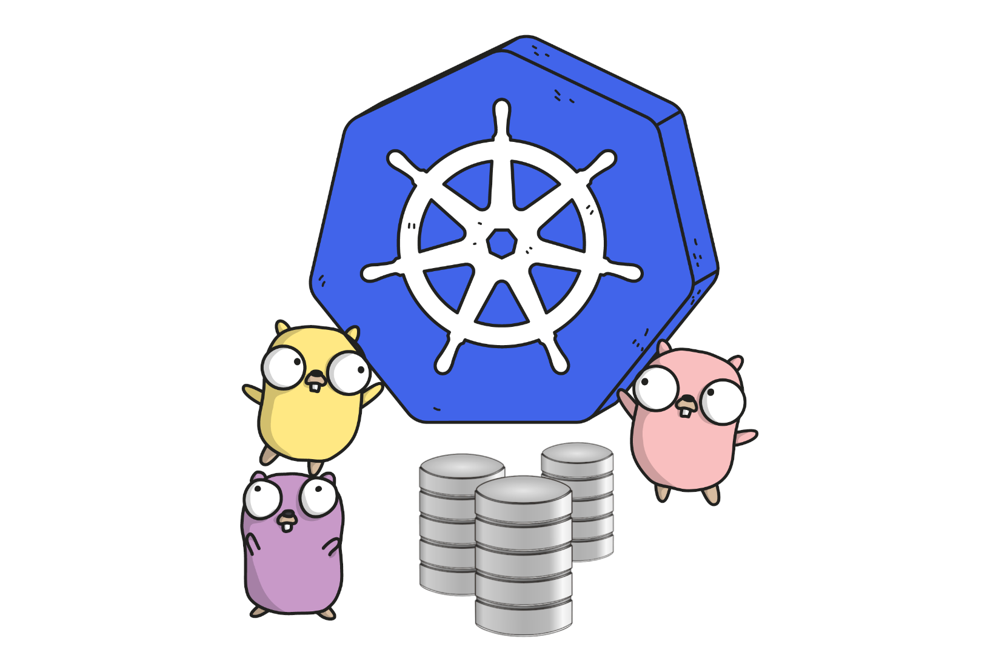

# Kubernetes DbaaS

*A Kubernetes Database as a Service (DBaaS) Operator for non-Kubernetes managed database management systems.*

## Abstract

This project aims at creating a Kubernetes Operator able to trigger a stored procedure in an external DBMS which in turn 
provisions a new database instance. Users are able to create new database instances by writing the API Object 
configuration using Kubernetes Custom Resources. The Operator watches for new API Objects and tells the target DBMS to 
trigger a certain stored procedure based on the custom resource specs.

## Motivation

There are cases where an organization cannot or doesn't want to host their precious data in cloud environments and searches 
for a way to bridge the gap between their Kubernetes clusters and on-premise DBMS solutions. Imagine an organization composed 
by developers, system administrators and database administrators. Developers want their database instance ready ASAP, 
system administrators want to integrate everything under Kubernetes, and database administrators have to keep control
over the provisioning process as close as possible to the DBMS solutions while still automating repetitive tasks

One of the Operator's strongest points is the separation of concerns between users, system administrators and database 
administrators. DBAs can retain full control on the lifecycle of database instances by creating **stored procedures** 
for each operation. This decouples the configuration from the implementation and ensures a well-defined boundary between 
the Kubernetes and Database worlds. Companies with strict compliance requirements can configure an opaque provisioning 
system for databases where data and business logic is kept as close as possible to their location without having to
resort to any third-party tool; the only requirement is a defined [contract](https://en.wikipedia.org/wiki/Design_by_contract) 
between the system and database infrastructures.

## Main technologies

- Go 1.16 or newer
- operator-sdk v1.7.2 or newer 
- Kubernetes v1.21.0 or newer
- Helm v3

## Main features

### Create database 

### Delete database

- Level-based logging
- Event logging, metrics
- Credential rotation
- Helm deployment
- Rate-limited requests
- Modern tech-stack
- Flexible configuration

## Manuals

Set up the Operator using the Sysadmin guide. After that, end-users can use the end-user guide to learn how to provision a database through the Operator. 

- [Database administrator guide](docs/dba_guide.md)
- [System administrator guide](docs/sysadmin_guide.md)
- [End-user guide](docs/enduser_guide.md)

## Supported DBMS

- SQLServer
- PostgreSQL
- MySQL/MariaDB

### Additional notes

Encrypted DBMS connections are not supported.

## Known issues

## Code reference

To be done (godoc present on the code).

## Contribute

Please read the [contributing guidelines](docs/contributing.md). 

## Credits

## License
